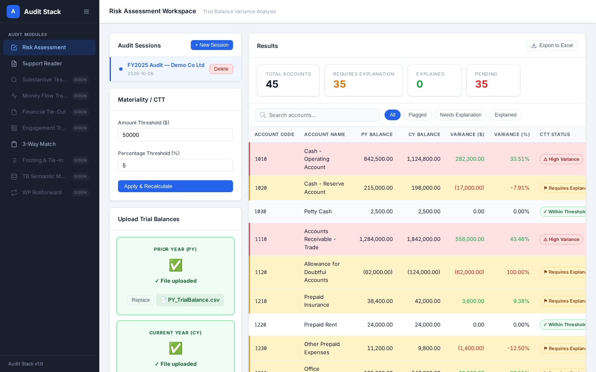
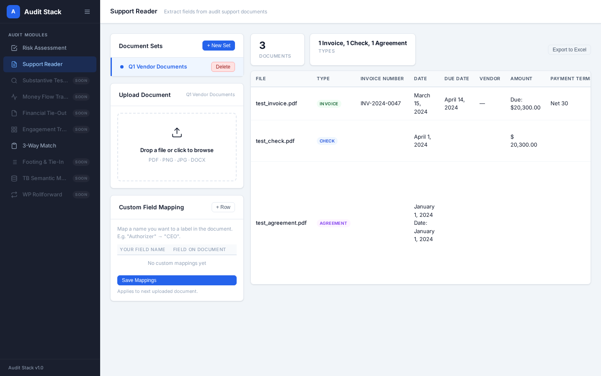
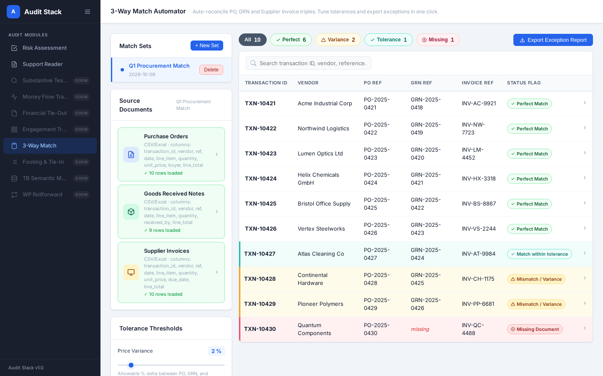

# Audit Stack

Local web-based audit platform (Flask + SQLite + vanilla JS).

**Live:** https://audit-stack.onrender.com







**Modules:** Risk Assessment (trial balance variance & materiality), Support Reader (offline document extraction), 3-Way Match Automator.

## Run locally
```
pip install -r requirements.txt
python3 app.py   # http://localhost:5000
```
Sample data is in `mock_data/`. The SQLite database is created on first run.

## Deploy (Render)
`render.yaml` is included: New → Blueprint → select this repo. Free tier has an ephemeral disk (data resets on restart) and no Tesseract, so OCR of scanned documents is unavailable; text-based PDFs/DOCX work.
